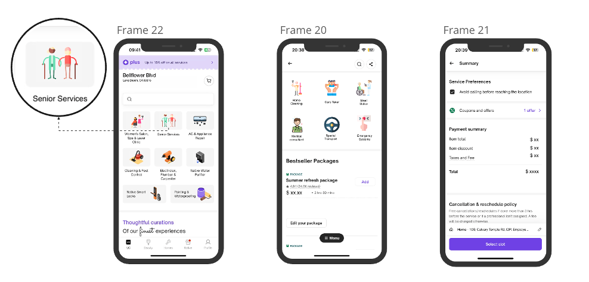
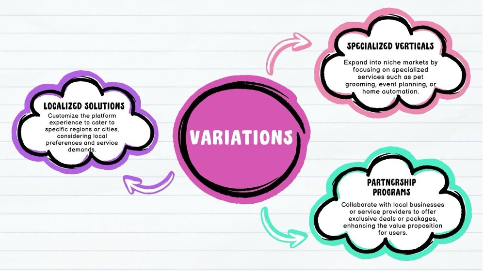

# Urban Company Care Plus

**Empowering Seniors Through Personalized At-Home Services**  
_A system analysis and design project built on empathy, accessibility, and innovation._

---

## 📌 Overview

Urban Company Care Plus is a specialized extension of the Urban Company platform tailored for senior citizens and individuals with accessibility needs. This project was developed under the IS 685 – System Analysis and Design course, blending user-centered design, agile sprints, and real user feedback to shape a scalable, high-impact service.

---

## 🧭 Design Thinking in Action

At the heart of this project is human-centered design. Our team began with problem framing, brainstorming, and rough solution drafting. We addressed common user pain points around clarity, trust, and accessibility in on-demand services.

---

## 🔁 Development Process

The development was structured in five key stages aimed at enhancing usability, trust, and engagement.

1. **Homepage Redesign** – Simplified navigation using icons and clear descriptions  
2. **Professional Profiles** – Photos, bios, ratings, and verification  
3. **Booking Process** – Streamlined steps with customizable options  
4. **User Feedback & Support** – Prompts, FAQ section, and support tools  
5. **Community Engagement** – Forums and content-sharing for trust and bonding

---

## 📲 Storyboarding the Experience

To visualize the user flow, we created a storyboard that walks through the booking journey from the app launch to payment.

- **Opening the App**  
- **Selecting Service Type**  
- **Browsing Services**  
- **Choosing a Package**  
- **Entering Address & Cart**  
- **Finalizing Booking & Payment**

---

## 🧪 Interactive Prototypes

We developed a clickable mobile prototype showcasing the "Senior Services" category using Frame 22. These interfaces demonstrate how simple and effective elder care booking can be.

- **Frame 22**: Home screen with Senior Services tab  
- **Frame 20**: Customizable Bestseller Packages  
- **Frame 21**: Payment summary and confirmation

---

## 🌀 Product Variations

To ensure market fit across diverse regions and needs, we brainstormed strategic product variations.

- **Localized Solutions** – Tailor UI and services to region-specific needs  
- **Specialized Verticals** – Serve niche markets like pet care, smart homes  
- **Partnership Programs** – Collaborate with local vendors for bundled offers

---

## 💡 Feature Ideas Turned Roadmap

Real user insight shaped our backlog. Here are some of the features that emerged during brainstorming and user interviews:

- Upload photos for service prep  
- Group bookings for multiple services  
- Personalized recommendations  
- Elder-focused service filters

---

## 👥 Target Audience

- **Senior Citizens** – our primary user group  
- **Caregivers & Family Members** – support agents for bookings  
- **Service Professionals** – trusted providers and partners  
- **Urban Company Admins** – operational oversight and quality control

---

## 🚀 Sprint Highlights

| Day        | Focus Area |
|------------|------------|
| **Monday** | Research, Challenge Framing, Sprint Planning |
| **Tuesday**| Lightning Demos, Crazy 8s, Ideation |
| **Wednesday**| Sketching, Decision Making, Storyboarding |
| **Thursday**| Prototyping, Content Creation |
| **Friday** | User Testing, Iteration, Presentation

---

## 📈 Metrics Tracked

- 🧍‍♂️ Daily Active Users  
- 💸 Conversion Rate (search to booking)  
- 🔁 Repeat Bookings  
- ⭐ Feedback Scores  
- ⏱️ Average Time to Complete Booking

---

## 💬 User Feedback Themes

- “I love how easy this is to use — finally an app that speaks our language.” 
- “The senior-specific section is a thoughtful touch.” 
- “Please add voice support for navigation.” 
- “Being able to see provider reviews gave me peace of mind.”

---

## 🔐 Risk & Mitigation Strategy

| Risk Area               | Strategy |
|-------------------------|----------|
| Quality Assurance       | Verified professionals, transparent reviews |
| Market Competition      | Focus on underserved senior demographic |
| Technical Constraints   | Modular, scalable MVP architecture |
| Regulatory Compliance   | Local legal alignment and user data safeguards |
| User Onboarding Fatigue | Onboarding support, voice walkthroughs |

---

## 🧑‍💻 Team Contributions

| Role                  | Team Members                  |
|-----------------------|-------------------------------|
| Facilitator           | Avinash Mandalapu             |
| Product Owners        | Shoaeb, Kamal, Visnu          |
| Design & UX           | Rithika, Deepthi              |
| Technical Development | Mukesh                        |
| Marketing & Branding  | Deekshitha                    |
| Customer Insights     | Soujan                        |

---

## 📚 References

- Google Design Sprint Playbook  
- Frame 22 Prototyping Platform  
- AARP Research on Aging and Digital Services  
- Urban Company Existing Platform Review  
- Accessibility.gov UI Guidelines

---

## 🙏 Acknowledgements

Special thanks to Professor Bryan Horkan and the IS 685 cohort for guidance and collaboration. This project reflects our commitment to building technology that supports and uplifts senior citizens.

> _“We’re not just redefining elder care – we’re reimagining empowerment, dignity, and access through design.”_
